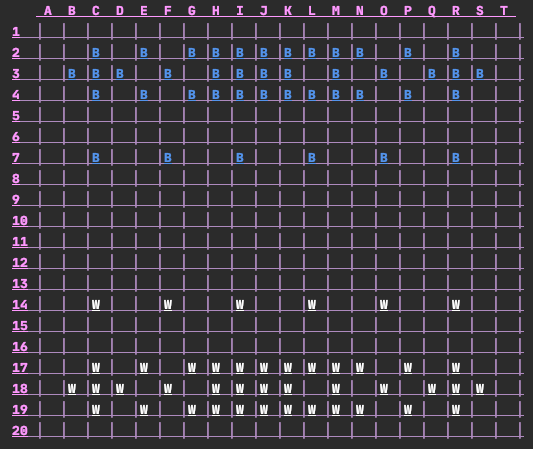

# Gess

Welcome to the game of Gess! This is a little project I created using Python to play an abstract board game called Gess. 
Initially, the program was simply meant to satisfy the final project requirements for my CS 162 course, Introduction to 
Computer Science II. However, I completed the program early and had some fun designing a front end for it using Pygame.

Please see the game rules for Gess [here](https://www.chessvariants.com/crossover.dir/gess.html). 

My favorite aspect about this project was the transformation of the game board. The course requirements limited
the tools I could use, thus my first iteration of the game board used ASCII escape sequences seen here:




I'm new to programming and had never used Pygame before, but I read the documentation and hard coded 86 Sprites 
to represent all of the game stones. I was so proud of my game board but it didn't function! I became discouraged and 
didn't think I could finish. After posting a picture of my static board, a classmate messaged me a video of their 
*working* game board. Oh hell no! Within a day I had a functional program, and after a few more iterations I created this 
beauty:


If you would like to play Gess, you will need to install Python 3.6+ for the terminal version and Pygame for the GUI 
version.

**Please install the latest version of Python:**

[Python](https://www.python.org/downloads/)


**To install PyGame:**
```
python3 -m pip install pygame
```
If you have trouble installing PyGame, please visit PyGame's [Getting Started](https://www.pygame.org/wiki/GettingStarted) page.


